# AI-Powered API Orchestrator (APIFlow AI) - Design Document

## Overview

APIFlow AI is an intelligent API orchestration platform that bridges the gap between no-code tools and manual development. It uses natural language processing to understand user requirements and automatically generates, deploys, and monitors multi-step API workflows across cloud platforms.

### Core Value Proposition
- **Natural Language to Code**: Transform plain English descriptions into working API integrations
- **Intelligent Discovery**: Automatically identify relevant APIs and services for user requirements
- **Real-time Orchestration**: Execute and monitor complex multi-step workflows
- **Auto-healing**: Detect and automatically fix API failures and integration issues

### Target Market
- Developers spending 40+ hours/month on API integrations
- Startups needing rapid API connectivity without extensive development overhead
- Enterprise teams looking to accelerate digital transformation initiatives

## Technology Stack & Dependencies

### Frontend Layer
- **Framework**: Next.js 14 with App Router
- **Styling**: Tailwind CSS for rapid UI development
- **Components**: Headless UI components for accessibility
- **State Management**: Zustand for lightweight global state
- **Real-time**: WebSocket integration for live workflow monitoring

### Backend Layer
- **Runtime**: Node.js with Express.js framework
- **Database**: PostgreSQL with Prisma ORM
- **Authentication**: NextAuth.js with JWT tokens
- **API Gateway**: Express middleware for request routing and validation

### AI & Intelligence Layer
- **Language Model**: OpenAI GPT-4 for natural language processing
- **Framework**: LangChain for AI workflow orchestration
- **Code Generation**: Custom templates and AST manipulation
- **API Discovery**: Intelligent matching algorithms

### Cloud Infrastructure
- **Serverless**: AWS Lambda for workflow execution
- **Database**: Supabase for managed PostgreSQL
- **File Storage**: AWS S3 for generated code and logs
- **Monitoring**: CloudWatch and custom metrics dashboard

### Third-party Integrations
- **Payment**: Stripe API for billing and webhooks
- **Communication**: Slack API, Twilio for notifications
- **Marketing**: Mailchimp API for email automation
- **Development**: GitHub API for code repository management

## Architecture

### System Architecture Overview

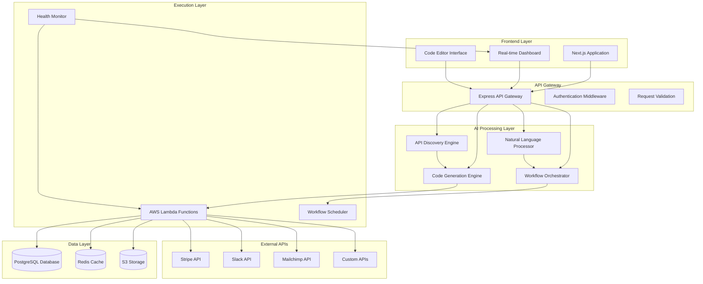

### Component Architecture

#### Frontend Components

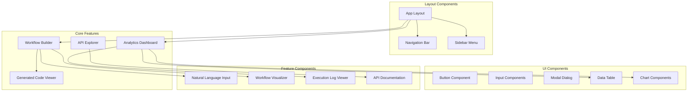

#### State Management Architecture

| State Slice | Responsibility | Persistence |
|-------------|----------------|-------------|
| `authStore` | User authentication and session | Session Storage |
| `workflowStore` | Current workflow configuration | Local Storage |
| `apiStore` | API catalog and connection status | Memory |
| `executionStore` | Workflow execution state and logs | WebSocket + Memory |
| `uiStore` | UI state and preferences | Local Storage |

### Data Flow Architecture

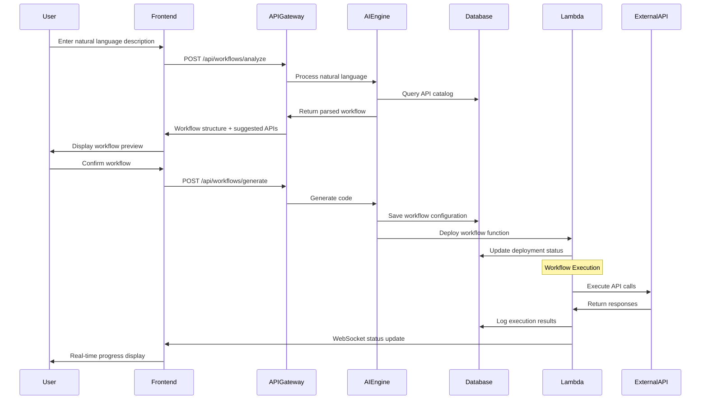

## API Endpoints Reference

### Workflow Management

| Endpoint | Method | Description | Authentication |
|----------|--------|-------------|----------------|
| `/api/workflows` | GET | List user workflows | Required |
| `/api/workflows` | POST | Create new workflow | Required |
| `/api/workflows/:id` | GET | Get workflow details | Required |
| `/api/workflows/:id` | PUT | Update workflow | Required |
| `/api/workflows/:id` | DELETE | Delete workflow | Required |
| `/api/workflows/:id/execute` | POST | Execute workflow | Required |

### AI Processing

| Endpoint | Method | Description | Authentication |
|----------|--------|-------------|----------------|
| `/api/ai/analyze` | POST | Analyze natural language input | Required |
| `/api/ai/suggest-apis` | POST | Get API suggestions | Required |
| `/api/ai/generate-code` | POST | Generate integration code | Required |
| `/api/ai/optimize` | POST | Optimize existing workflow | Required |

### API Discovery

| Endpoint | Method | Description | Authentication |
|----------|--------|-------------|----------------|
| `/api/apis` | GET | List supported APIs | Optional |
| `/api/apis/:provider` | GET | Get API documentation | Optional |
| `/api/apis/search` | GET | Search API catalog | Optional |
| `/api/apis/test-connection` | POST | Test API connection | Required |

### Request/Response Schema

#### Workflow Creation Request
```json
{
  "description": "When a new customer signs up in Stripe, add them to Mailchimp and send Slack notification",
  "name": "Customer Onboarding Flow",
  "triggers": ["stripe.customer.created"],
  "apis": ["stripe", "mailchimp", "slack"],
  "configuration": {
    "stripe": {
      "webhook_url": "auto-generated",
      "events": ["customer.created"]
    },
    "mailchimp": {
      "list_id": "user-specified",
      "tags": ["new-customer"]
    },
    "slack": {
      "channel": "#notifications",
      "message_template": "New customer: {{customer.name}}"
    }
  }
}
```

#### Workflow Response
```json
{
  "id": "wf_12345",
  "status": "active",
  "generated_code": {
    "language": "javascript",
    "framework": "nodejs",
    "code": "// Generated Lambda function code",
    "dependencies": ["stripe", "mailchimp", "slack"]
  },
  "deployment": {
    "function_arn": "arn:aws:lambda:us-east-1:...",
    "webhook_url": "https://api.apiflow.ai/webhooks/wf_12345"
  },
  "created_at": "2024-01-15T10:30:00Z"
}
```

## Data Models & ORM Mapping

### Core Database Schema

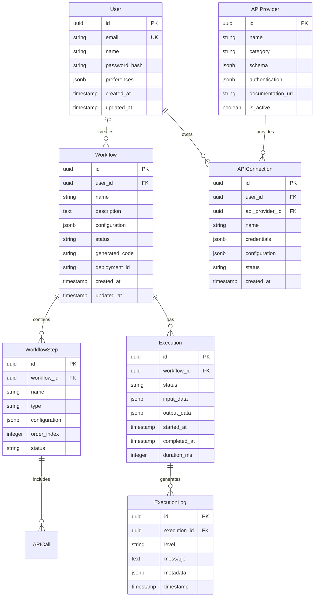

### Prisma Schema Configuration

```prisma
model User {
  id          String   @id @default(uuid())
  email       String   @unique
  name        String
  passwordHash String
  preferences Json?
  createdAt   DateTime @default(now())
  updatedAt   DateTime @updatedAt
  
  workflows      Workflow[]
  apiConnections APIConnection[]
  
  @@map("users")
}

model Workflow {
  id           String   @id @default(uuid())
  userId       String
  name         String
  description  String
  configuration Json
  status       String   @default("draft")
  generatedCode String?
  deploymentId String?
  createdAt    DateTime @default(now())
  updatedAt    DateTime @updatedAt
  
  user         User           @relation(fields: [userId], references: [id])
  steps        WorkflowStep[]
  executions   Execution[]
  
  @@map("workflows")
}
```

## Business Logic Layer

### AI Processing Architecture

#### Natural Language Understanding

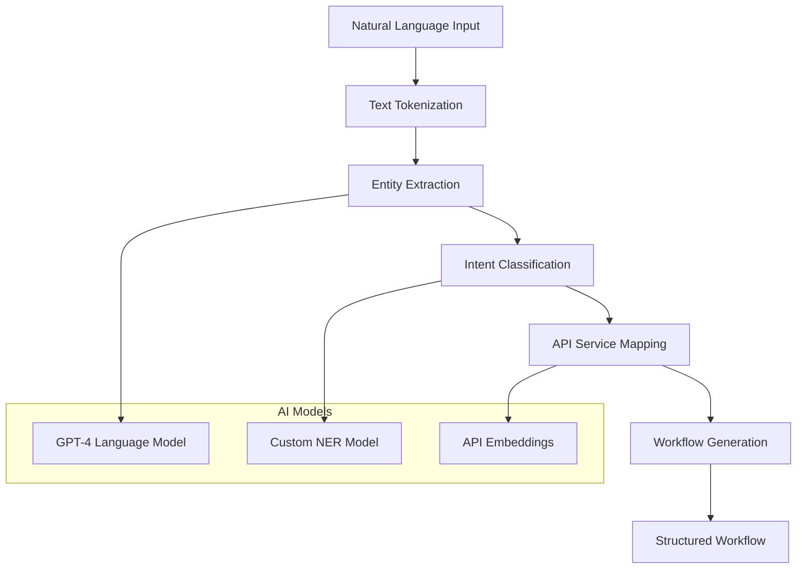

#### Code Generation Engine

| Template Type | Language | Framework | Use Case |
|---------------|----------|-----------|----------|
| `webhook-handler` | JavaScript | Node.js/Express | Incoming webhook processing |
| `api-client` | JavaScript | Axios/Fetch | External API calls |
| `data-transformer` | JavaScript | Lodash | Data mapping and transformation |
| `error-handler` | JavaScript | Custom | Error handling and retry logic |
| `lambda-function` | JavaScript | AWS Lambda | Serverless execution wrapper |

#### Workflow Orchestration Logic

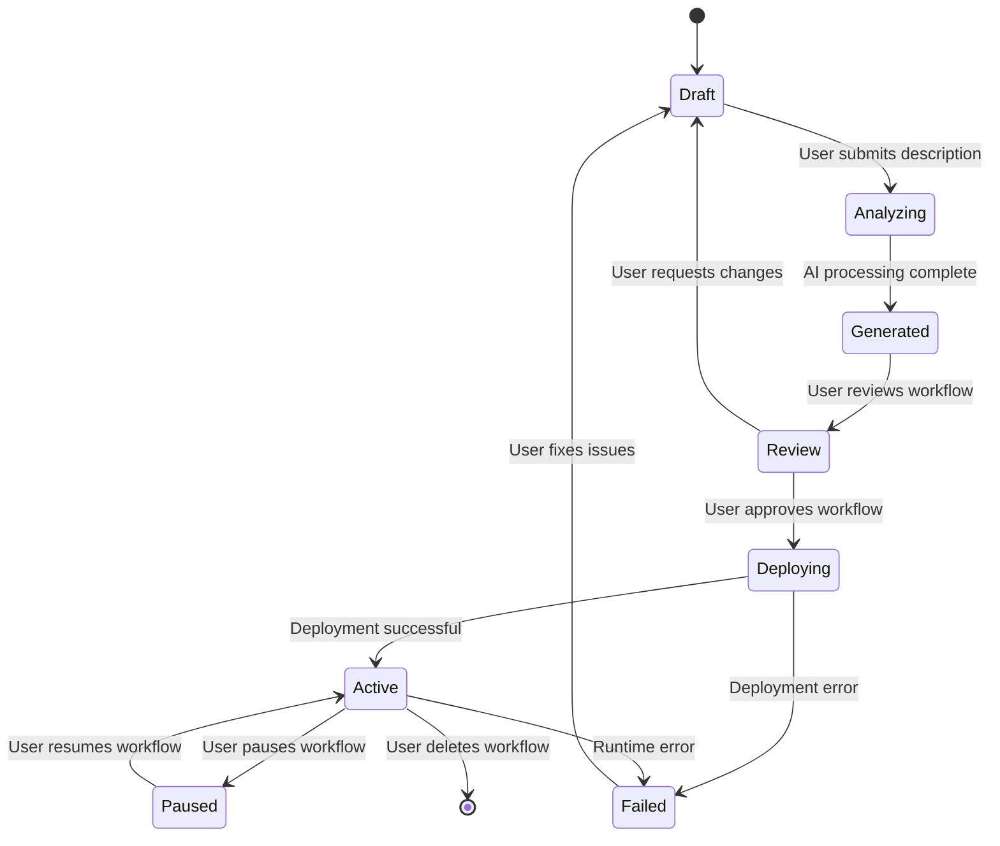

### API Integration Strategies

#### Authentication Management

| Provider | Auth Type | Implementation | Refresh Strategy |
|----------|-----------|----------------|------------------|
| Stripe | API Key | Header-based | No refresh needed |
| Mailchimp | OAuth 2.0 | Bearer token | Auto-refresh with stored refresh token |
| Slack | OAuth 2.0 | Bearer token | Auto-refresh with stored refresh token |
| Custom APIs | Various | Configurable | Provider-specific handling |

#### Error Handling & Retry Logic

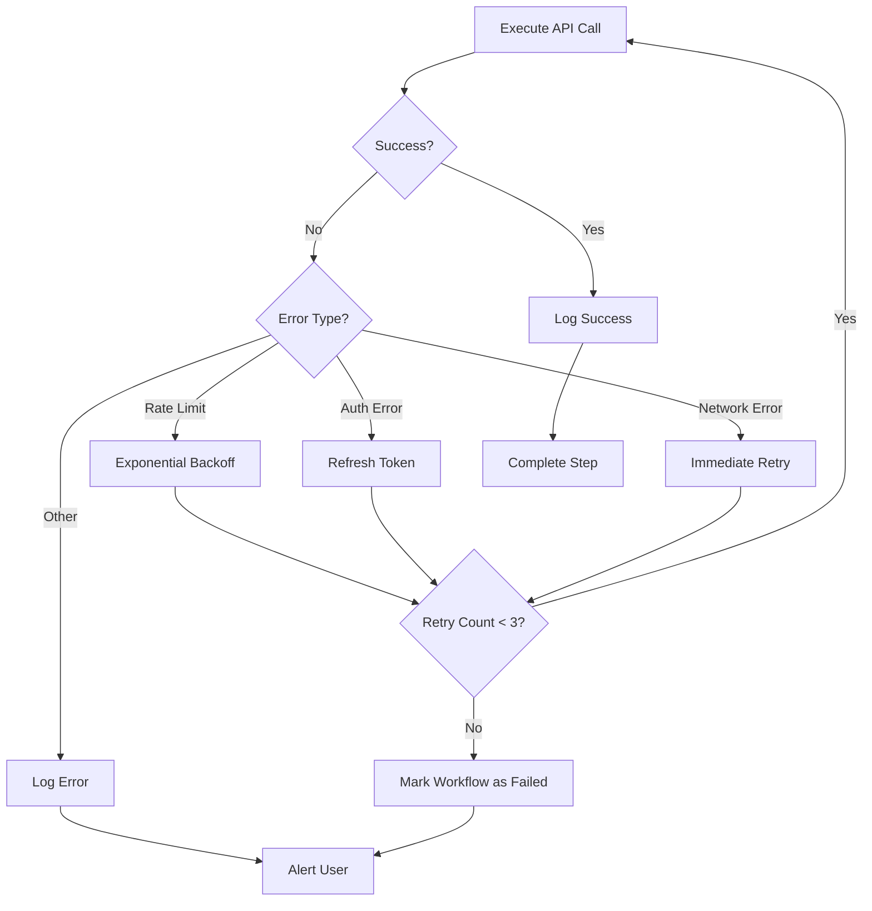

### Real-time Monitoring System

#### Metrics Collection

| Metric Category | Key Metrics | Collection Method |
|-----------------|-------------|-------------------|
| Performance | Response time, throughput, error rate | Custom middleware |
| Business | Workflows created, APIs connected, executions | Database events |
| System | CPU usage, memory, database connections | CloudWatch |
| User Behavior | Feature usage, session duration | Frontend analytics |

#### Alert Configuration

| Alert Type | Trigger Condition | Recipients | Action |
|------------|-------------------|------------|--------|
| Workflow Failure | Error rate > 10% in 5 minutes | Workflow owner | Email + Dashboard notification |
| API Downtime | Consecutive failures > 3 | Admin team | Slack alert + Auto-disable |
| High Latency | Response time > 5 seconds | DevOps team | CloudWatch alarm |
| Rate Limit Hit | 429 responses detected | Workflow owner | Pause workflow + Notification |

## Frontend Architecture

### Component Hierarchy

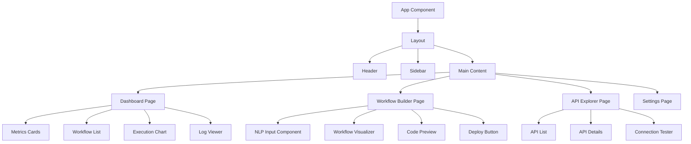

### State Management with Zustand

```typescript
// Workflow Store
interface WorkflowStore {
  workflows: Workflow[]
  currentWorkflow: Workflow | null
  isLoading: boolean
  
  // Actions
  fetchWorkflows: () => Promise<void>
  createWorkflow: (description: string) => Promise<void>
  updateWorkflow: (id: string, updates: Partial<Workflow>) => Promise<void>
  deleteWorkflow: (id: string) => Promise<void>
  executeWorkflow: (id: string) => Promise<void>
}

// Real-time Execution Store
interface ExecutionStore {
  executions: Record<string, Execution>
  logs: Record<string, ExecutionLog[]>
  
  // WebSocket handlers
  subscribeToWorkflow: (workflowId: string) => void
  unsubscribeFromWorkflow: (workflowId: string) => void
  addExecutionLog: (executionId: string, log: ExecutionLog) => void
}
```

### Routing & Navigation

| Route | Component | Access Level | Description |
|-------|-----------|--------------|-------------|
| `/` | Dashboard | Authenticated | Main dashboard with metrics |
| `/workflows` | WorkflowList | Authenticated | List of user workflows |
| `/workflows/new` | WorkflowBuilder | Authenticated | Create new workflow |
| `/workflows/:id` | WorkflowDetails | Authenticated | View/edit specific workflow |
| `/apis` | APIExplorer | Authenticated | Browse available APIs |
| `/settings` | Settings | Authenticated | User preferences and API keys |
| `/auth/login` | Login | Public | User authentication |
| `/auth/signup` | Signup | Public | User registration |

### Styling Strategy

#### Tailwind Configuration
- **Color Palette**: Custom brand colors with semantic naming
- **Component Classes**: Reusable component-specific utility classes
- **Responsive Design**: Mobile-first approach with breakpoint-specific styles
- **Dark Mode**: CSS variables for theme switching

#### Design System Components

| Component | Variants | Props | Usage |
|-----------|----------|-------|-------|
| `Button` | primary, secondary, danger | size, disabled, loading | All interactive actions |
| `Input` | text, email, password, textarea | placeholder, validation | Form inputs |
| `Card` | default, outlined, elevated | padding, clickable | Content containers |
| `Badge` | success, warning, error, info | size, variant | Status indicators |
| `Modal` | dialog, fullscreen, drawer | size, backdrop | Overlays and popups |

## API Integration Layer

### External API Abstractions

```typescript
// Generic API Client Interface
interface APIClient {
  authenticate(credentials: Record<string, any>): Promise<boolean>
  testConnection(): Promise<boolean>
  executeCall(endpoint: string, method: string, data?: any): Promise<any>
  handleWebhook(payload: any): Promise<void>
  refreshToken?(): Promise<string>
}

// Stripe Implementation
class StripeClient implements APIClient {
  constructor(private apiKey: string) {}
  
  async authenticate(credentials: { apiKey: string }): Promise<boolean> {
    // Validate Stripe API key
  }
  
  async executeCall(endpoint: string, method: string, data?: any): Promise<any> {
    // Stripe-specific API call implementation
  }
  
  async handleWebhook(payload: any): Promise<void> {
    // Process Stripe webhook events
  }
}
```

### Webhook Management System

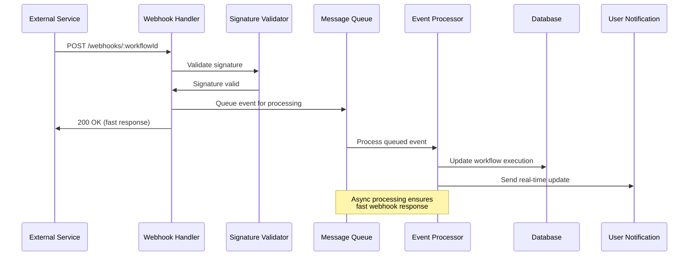

### API Rate Limiting & Quotas

| Provider | Rate Limit | Quota Management | Retry Strategy |
|----------|------------|------------------|----------------|
| Stripe | 100 req/sec | Per-account tracking | Exponential backoff |
| Mailchimp | 10 req/sec | Daily API call limits | Queue-based throttling |
| Slack | 1 req/sec | Per-workspace limits | Smart batching |
| Custom APIs | Configurable | User-defined limits | Provider-specific |

## Testing Strategy

### Unit Testing Approach

#### Frontend Testing (Jest + React Testing Library)

```typescript
// Component Testing Example
describe('WorkflowBuilder Component', () => {
  test('should generate workflow from natural language input', async () => {
    render(<WorkflowBuilder />)
    
    const input = screen.getByPlaceholderText('Describe your workflow...')
    await userEvent.type(input, 'When Stripe payment succeeds, send email')
    
    const generateButton = screen.getByText('Generate Workflow')
    await userEvent.click(generateButton)
    
    await waitFor(() => {
      expect(screen.getByText('Stripe Payment Webhook')).toBeInTheDocument()
      expect(screen.getByText('Email Notification')).toBeInTheDocument()
    })
  })
  
  test('should handle API generation errors gracefully', async () => {
    // Mock API failure
    jest.spyOn(api, 'generateWorkflow').mockRejectedValue(new Error('API Error'))
    
    render(<WorkflowBuilder />)
    // Test error handling...
  })
})
```

#### Backend Testing (Jest + Supertest)

```typescript
// API Endpoint Testing
describe('POST /api/workflows', () => {
  test('should create workflow with valid input', async () => {
    const workflowData = {
      description: 'Send email when payment received',
      name: 'Payment Notification'
    }
    
    const response = await request(app)
      .post('/api/workflows')
      .set('Authorization', `Bearer ${authToken}`)
      .send(workflowData)
      .expect(201)
    
    expect(response.body).toHaveProperty('id')
    expect(response.body.status).toBe('draft')
  })
  
  test('should validate required fields', async () => {
    const response = await request(app)
      .post('/api/workflows')
      .set('Authorization', `Bearer ${authToken}`)
      .send({})
      .expect(400)
    
    expect(response.body.errors).toContain('description is required')
  })
})
```

#### AI Logic Testing

```typescript
// Natural Language Processing Tests
describe('AI Workflow Generator', () => {
  test('should identify correct APIs from description', async () => {
    const description = 'When new Stripe customer, add to Mailchimp and notify Slack'
    
    const result = await aiEngine.analyzeDescription(description)
    
    expect(result.apis).toContain('stripe')
    expect(result.apis).toContain('mailchimp')
    expect(result.apis).toContain('slack')
    expect(result.trigger).toBe('stripe.customer.created')
  })
  
  test('should generate valid Node.js code', async () => {
    const workflow = {
      trigger: 'stripe.customer.created',
      steps: [
        { type: 'mailchimp.add_subscriber' },
        { type: 'slack.send_message' }
      ]
    }
    
    const generatedCode = await codeGenerator.generateLambda(workflow)
    
    expect(generatedCode).toContain('exports.handler')
    expect(generatedCode).toContain('stripe')
    expect(generatedCode).toContain('mailchimp')
    // Validate syntax
    expect(() => new Function(generatedCode)).not.toThrow()
  })
})
```

### Integration Testing

#### End-to-End Workflow Testing

```typescript
// Cypress E2E Tests
describe('Complete Workflow Creation', () => {
  it('should create and deploy working workflow', () => {
    cy.login('testuser@example.com', 'password')
    
    // Navigate to workflow builder
    cy.visit('/workflows/new')
    
    // Enter natural language description
    cy.get('[data-testid="workflow-description"]')
      .type('When customer pays via Stripe, add them to Mailchimp list')
    
    // Generate workflow
    cy.get('[data-testid="generate-button"]').click()
    
    // Verify AI suggestions
    cy.get('[data-testid="suggested-apis"]').should('contain', 'Stripe')
    cy.get('[data-testid="suggested-apis"]').should('contain', 'Mailchimp')
    
    // Configure API connections
    cy.get('[data-testid="stripe-config"]').click()
    cy.get('[data-testid="api-key-input"]').type('sk_test_123...')
    
    // Deploy workflow
    cy.get('[data-testid="deploy-button"]').click()
    
    // Verify deployment success
    cy.get('[data-testid="deployment-status"]').should('contain', 'Active')
    cy.get('[data-testid="webhook-url"]').should('be.visible')
  })
})
```

### Test Data Management

#### Mock API Responses

```typescript
// API Mocking Strategy
const mockStripeWebhook = {
  id: 'evt_test_webhook',
  type: 'customer.created',
  data: {
    object: {
      id: 'cus_test_customer',
      email: 'test@example.com',
      name: 'Test Customer'
    }
  }
}

const mockMailchimpResponse = {
  id: 'abc123',
  email_address: 'test@example.com',
  status: 'subscribed',
  timestamp_signup: '2024-01-15T10:30:00Z'
}
```

#### Test Environment Configuration

| Environment | Database | External APIs | Deployment |
|-------------|----------|---------------|------------|
| Unit Tests | In-memory SQLite | Mocked responses | Local execution |
| Integration | Test PostgreSQL | Sandbox APIs | Local containers |
| E2E | Staging database | Test API keys | Staging environment |
| Production | Production DB | Live APIs | AWS Production |

### Performance Testing

#### Load Testing Scenarios

| Scenario | Target Metrics | Tools | Success Criteria |
|----------|----------------|-------|------------------|
| Workflow Creation | 100 concurrent users | Artillery.js | < 2s response time |
| Webhook Processing | 1000 req/min | Apache Bench | < 100ms processing |
| Dashboard Loading | 50 concurrent users | Lighthouse CI | < 3s page load |
| Code Generation | 10 concurrent AI requests | Custom scripts | < 5s generation time |

## Action Flow Architecture

### Complete User Journey Flow

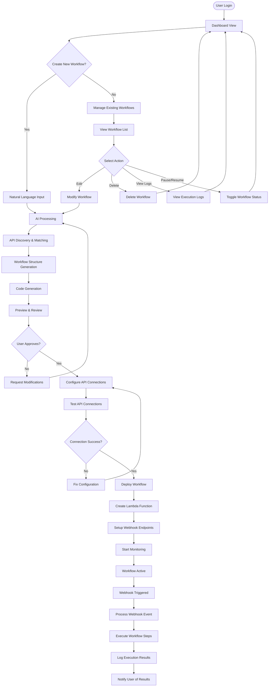

### Detailed Natural Language Processing Flow

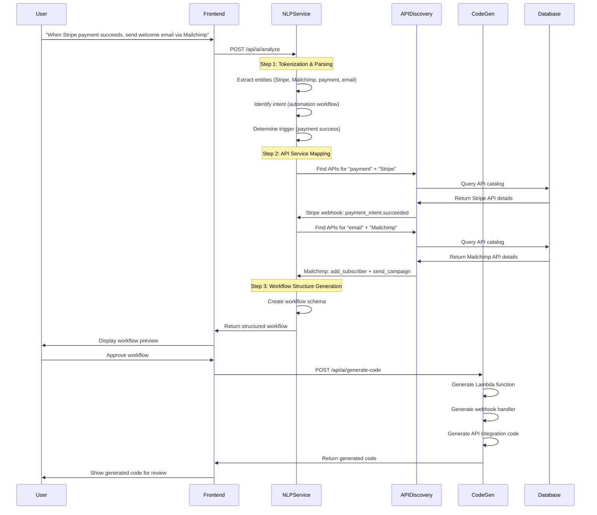

### Workflow Execution Action Flow

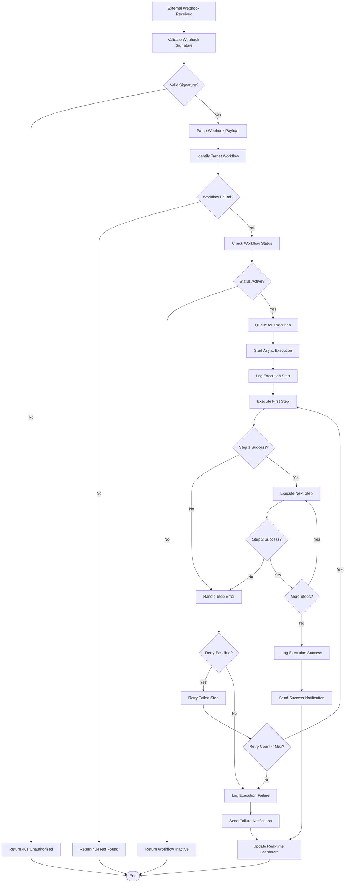

### API Connection Configuration Flow

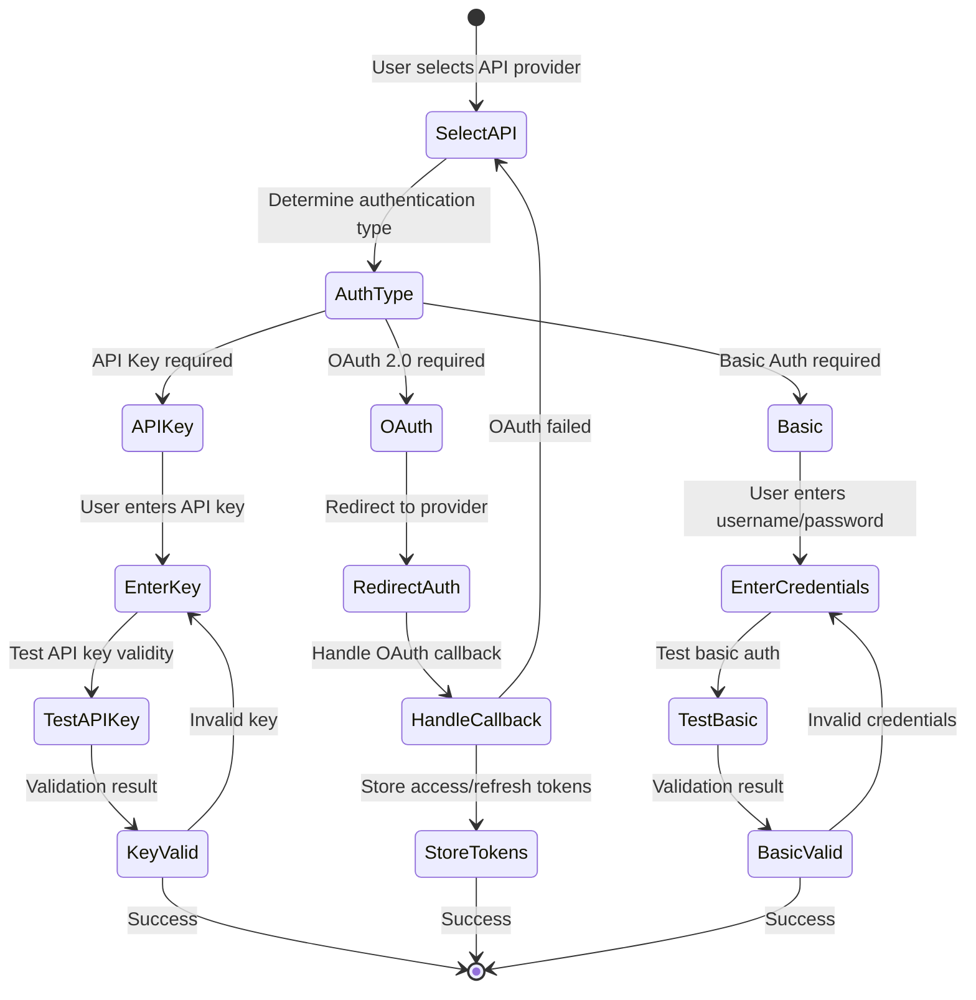

### Real-time Monitoring Action Flow

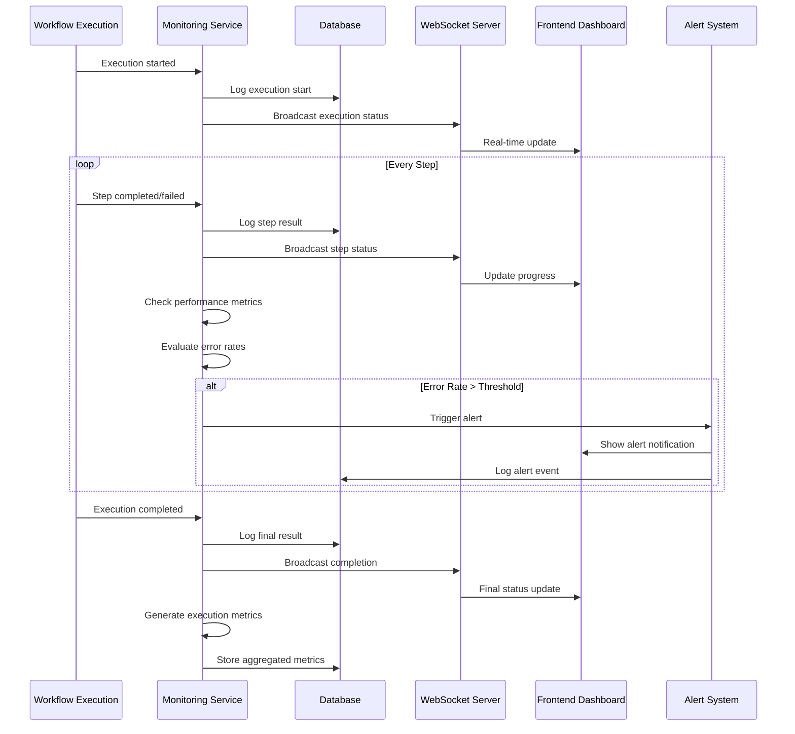

### Error Handling & Recovery Flow

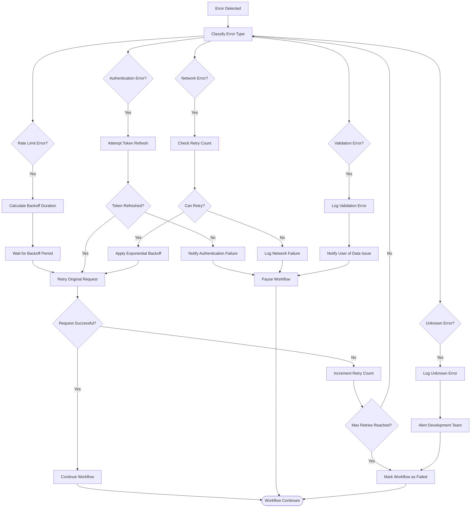

### Code Generation Process Flow

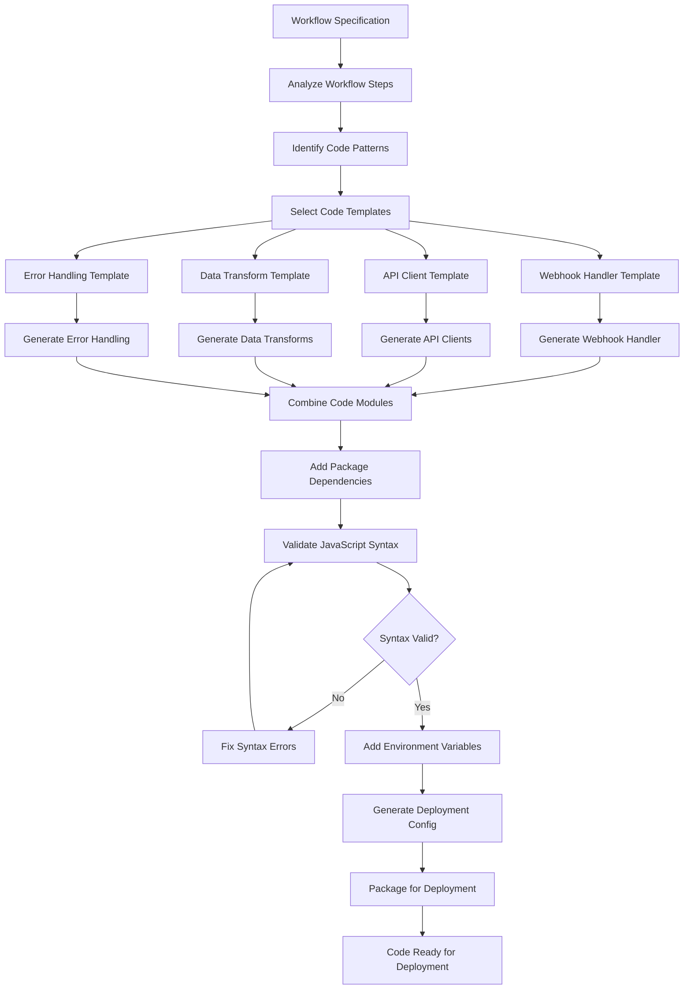


